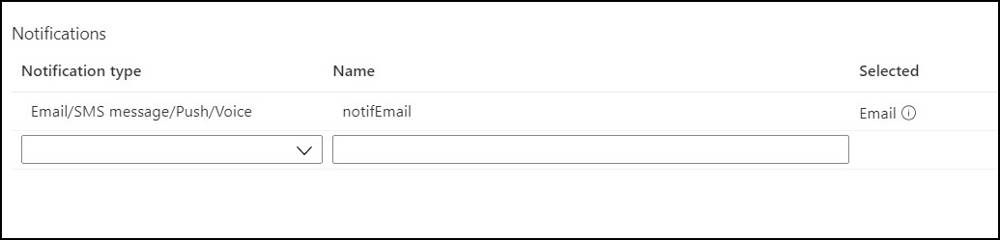

## Table Of Contents:
#### Deploy Data Factory with optional SQL Server and SQL Database
#### Setup and Configure Alerts for Azure Data Factory

## Deploy Data Factory with optional SQL Server and SQL Database

#### Prerequisites:
1. Resource group for the deployment.

#### To be provided:
1. Resource Group
2. Data Factory Name
3. Storage Account Name
4. Option (Yes or No) to deploy or not to deploy SQL Server, SQL Database and SQL sink within the pipeline.
5. SQL Server Name (If selected 'Yes')
6. SQL Database Name (If selected 'Yes')
7. SQL Login Administrator Username (If selected 'Yes').
8. SQL Login Administrator Password (If selected 'Yes').

**NOTE** - If you go with SQL sink, the name of the table where data is written is _**covid_tracking**_.

Click the following button to deploy all the resources.

#### Manually Trigger Pipeline

After the deployment you can go in side your resource group open the ADF auther and monitor section and trigger the pipeline as given below.

#### Configure Firewall Rule
After deployment, to access the newly created SQL server from your client IP, configure the firewall rule as described in the following GIF:

# Setup and Configure Alerts for Azure Data Factory

## Step 1: Deploy the templates

1. Open git repository for the project and click on **Deploy to Azure**, this will open up a new window.

2. Select your default Azure account(the one you want to deploy Data factory into), and it will take you to parameters dashboard.

3. Select **"Enable Microsoft Teams Notification"** to yes if you want to send alerts to Microsoft teams too, other select no if you want Email alerts only.

4. Enter your email address in the field titled **Notification Email** to send alerts notification to that email. You cant enter more than one email at the deployment time, but you can add them later on once the deployment is completed. The method for which will be elaborated below.

5. Click on **Purchase** once you are satisfied with all the parameters and wait for the deployment to end.

 Now once the deployment is complete, you will have alerts setup in data factory. There will be different features like send alerts to Microsoft Teams(via Logic App) etc depending on the options you selected at the deploy time.

If you have selected Microsoft Teams notification, then your Logic app needs to be authenticated to your "Microsoft Teams" account for it to be able to send notifications.

## Step 2: Authenticating Microsoft Teams account with Azure Logic App

1. First navigate to the resource group that containes your deployment and find the resource titled **"msftTeamsConnectionAuth"**. Click on it and navigate to its **"Edit API connection"** option from the sidebar. 

2. In the window there will be a button titled **"Authorize"**, click on it and it will open up Microsoft sign in page. Enter the teams account credentials and it will authorize you to your teams account.

3. Click on **"Save"** to save the authorization information and navigate to resource group.

4. Now click on the deployed logic app, the default name of which is **"TeamsNotify"**. Click on the option **"Logic app designer"** from the side bar under heading **"Development tools"**. This will open a visual editor, if there was problem connecting to teams then it will display connection error. In that case, refer back to step 1.

5. Next if the connection is successful, click on **switch** button thats in the designer panel. It will open 6 different cases, click on a case and you will see a box labeled **"Post a message (V3)"**, click on that. Next to select **"Team"** and **"Channel"**, click on the cross button at the right side of these two field to open up drop down menu for available Team and Channel in Teams account. If you cant see your "Team" and "Channel", goto step 1, there might be problem with authentication. Do this for all 6 cases.

6. Finally click on save and your logic app setup is completed.

With this our setup of Alerts is complete.

Next we elaborate on how to add multiple emails in the action group.

## Adding multiple emails in action group

Follow these steps to add multiple emails to recieve alerts on.

1. First type "Alerts" in the Azure search bar. Click on "Alerts" and it will take you to main alerts dashboard.

2. In the top buttons, there is a button **"Manage actions"**, click on that.

3. Once in the manage actions pane, there will be list of all the action groups. Select you action group.

4. Finally at the bottom in section **Notifications**, there is already an email created which is the default email you entered at the deployment time. Here you can add as many emails as you want to send alert notifications.

