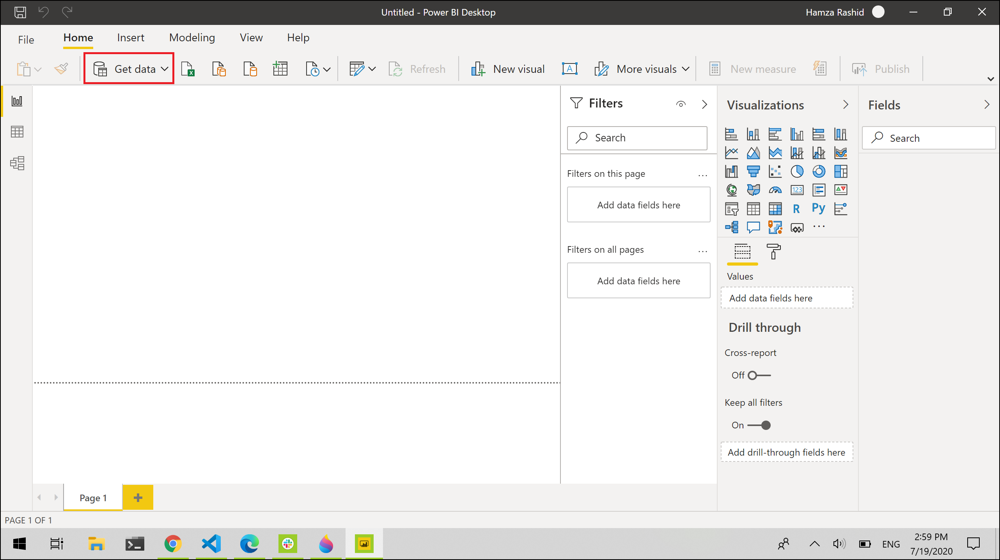
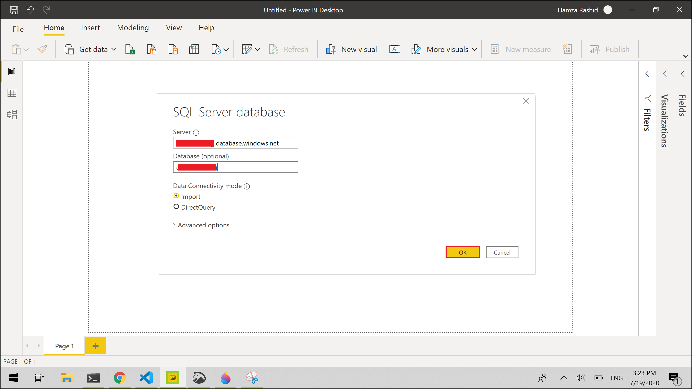
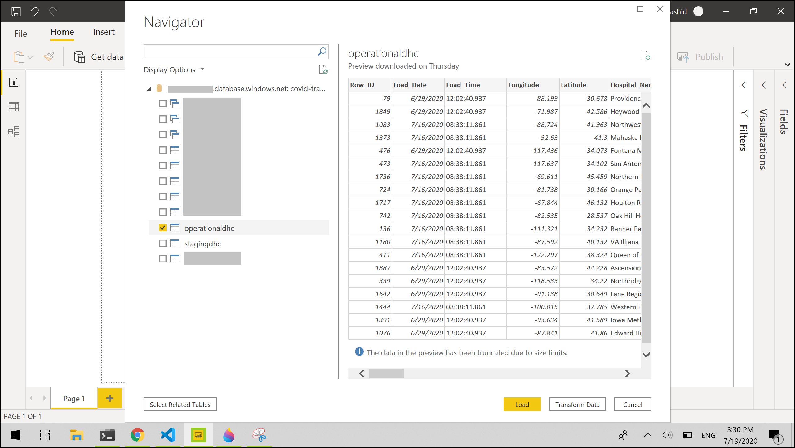
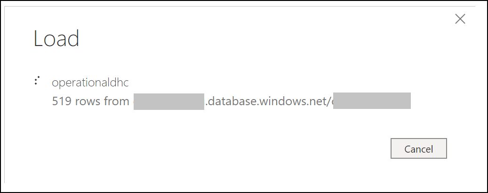
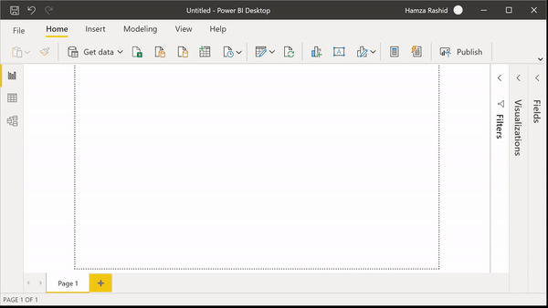

# Prerequisites

  1. Customer Azure Data Factory Pipeline is deployed and data has been successfully written to Synapse.
---------------------------------------------
# Load data from a Synapse table in Power BI

1. Open Power BI Desktop

2. Click on 'Get Data'

3. Select **Azure** -> **Azure SQL Data Warehouse** -> **Connect**

4. Provide the following credentials to connect to Synapse.

- Synapse Server Name
- Synapse Database name
- Database username
- Database password

Upon providing the credentials, Power BI will connect to Synapse and show a database schema.

5. Select the tables to load the data from. In our case this is the **operationaldhc** table, you may choose any of the tables to load data from. After selecting the table click on **Load** button to load the data.

After this, Power BI will start loading the data e.g.

------------------------------------------------------------

# Create Visualization
After the data has been loaded into Power BI, you can view the data model in the **Fields** pane, located on the right-hand side.

In this case, we are creating a Stacked Column Chart that shows the **Average Ventilator Usage** by **State Name**.

