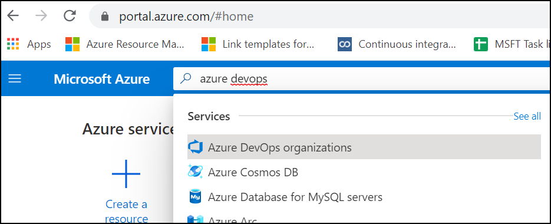
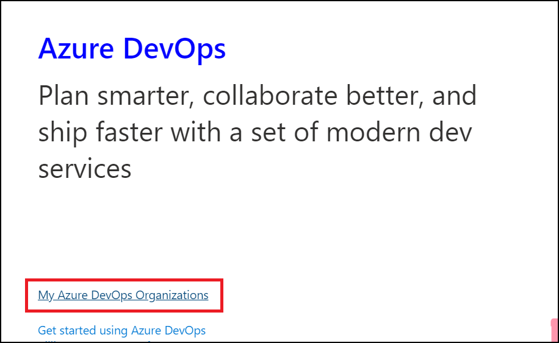
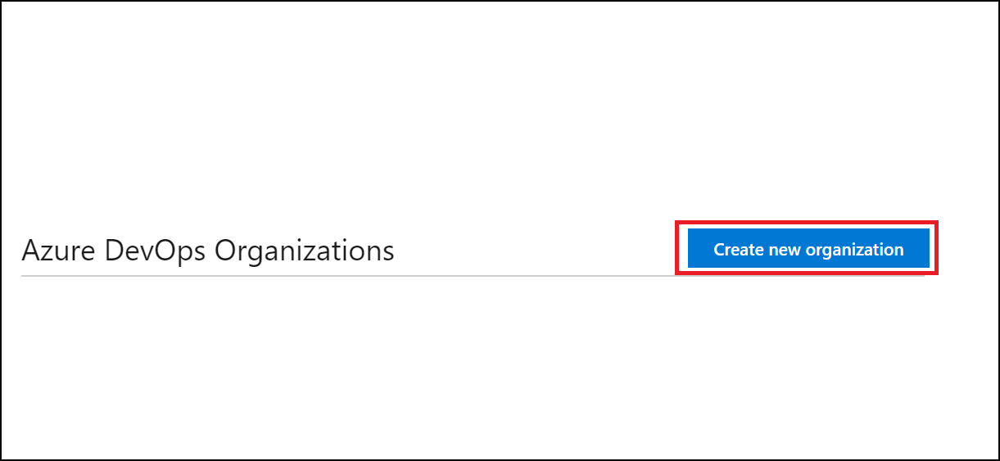
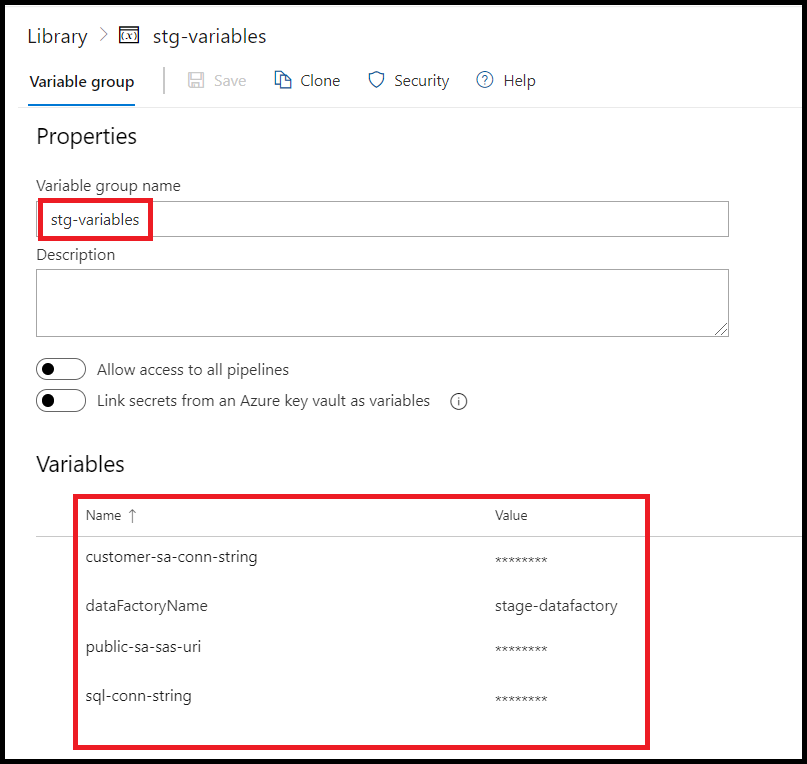
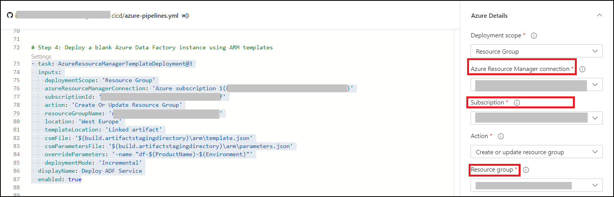

# CI/CD Setup for Azure Data Factory

## Step 1: Connect your Dev Azure Data factory with Github
 
1. Open Azure Data Factory that you want to use with the development environment.

2. Click on **Author & Monitor**, this will open the data factory UI's Home.

3. Now go to **Manage** from the menu on the left side, then click on  **Git Configuration** -> **Set Up Code Repository**. This will show a UI blade with a dropdown listing the supported repository types. As of today it only supports **Github** and **Azure DevOps Git**.

*Note: If you wish to choose Github, please create an empty repo before proceeding to the next steps.*

4. Select the repository type of your choice and provide the required credentials.

5. 
    - Now we have to select a repo to connect this data factory to. Select the repo from the **Git Repository Name** dropdown. (You may create a new one if using Azure DevOps Git)
    
    - Select **master** as the collaboration branch. This branch will be used for publishing to Azure Data factory. By default it is master. Change this if you want to deploy/publish resources from another branch.
    
    - **Root Folder** is the directory where all of the Data factory resource's JSON files will be copied to. Leave it as '**/**'.

6. Click on **Apply** to save the changes.

Here, we have successfully connected the Azure Data factory to a Git Repo. this has saved all of the resource's JSON files in the branch that we specified. 

To be able to replicate the resources in this data factory we need the ARM templates that are generated when we publish the changes in the Azure Data Factory. When you click on publish, it takes the changes from the collaboration branch i.e master in this case, creates ARM templates, and pushes them in the **adf_publish** branch.


Now let's go ahead and publish the changes.

## Step 2: Add the azure pipelines files in the adf_publish repo

1. Clone the repo that you created above and checkout the **adf_publish** branch.

2. Create the following directories.

  - **/cicd**
  - **/resources/arm/blank-adf**

3. Add the following two files in the **/resources/arm/blank-adf** folder.

**template.json**

```
{
    "$schema": "https://schema.management.azure.com/schemas/2015-01-01/deploymentTemplate.json#",
    "contentVersion": "1.0.0.0",
    "parameters": {
        "name": {
            "defaultValue": "myv2datafactory",
            "type": "String"
        },
        "location": {
            "defaultValue": "East US",
            "type": "String"
        },
        "apiVersion": {
            "defaultValue": "2018-06-01",
            "type": "String"
        }
    },
    "resources": [
        {
            "type": "Microsoft.DataFactory/factories",
            "apiVersion": "[parameters('apiVersion')]",
            "name": "[parameters('name')]",
            "location": "[parameters('location')]",
            "identity": {
                "type": "SystemAssigned"
            },
            "properties": {}
        }
    ]
}

```


**Parameters.json**
```
{
    "$schema": "https://schema.management.azure.com/schemas/2015-01-01/deploymentParameters.json#",
    "contentVersion": "1.0.0.0",
    "parameters": {
        "name": {
            "value": "df-azdo-datafactory-stg"
        },
        "location": {
            "value": "westeurope"
        },
        "apiVersion": {
            "value": "2018-06-01"
        }
    }
}
```

4. Add the following file in the **/cicd** directory.

**azure-pipelines.yml**

```
# Basic YAML pipeline for Azure Data Factory


# Batching trigger set run only on a adf_publish branch
# cicd folder is not watched
trigger:
  batch: true
  branches:
    include:
      - adf_publish 
    exclude:
      - master
  paths:
    exclude:
      - cicd/* 
    include:
      - "*"


# Link the variable group to read the variables from:
- group: stg-variables


# The build agent is based on Windows OS. 
# Linux agents have some differences in available commands and folder paths expressions, etc
pool:
   vmImage: "windows-latest"


steps:

# Step 1: Checkout code into a local folder src
- checkout: self
  path: src


# Step 2a: Find arm JSON files for deployment of a blank ADF in src and copy them into the artifact staging folder
- task: CopyFiles@2  
  inputs:
    SourceFolder: '$(Pipeline.Workspace)\src\resources\arm\blank-adf'
    Contents: '**/*.json'
    TargetFolder: '$(build.artifactstagingdirectory)\arm'
    CleanTargetFolder: true
    OverWrite: true
  displayName: 'Extra ARM - Blank ADF Service'
  enabled: true

# Step 2b: Find other ADF files, which will deploy pipelines, datasets and so on  in a folder adf_publish and copy them into the artifact folder
- task: CopyFiles@2  
  inputs:
    SourceFolder: '$(Pipeline.Workspace)\src'
    Contents: '**/*ForFactory.json'
    TargetFolder: '$(build.artifactstagingdirectory)\adf_publish'
    CleanTargetFolder: true
    OverWrite: true
    flattenFolders: true
  displayName: 'Extract ARM - ADF Pipelines'
  enabled: true


# Step 3: Debugging - print the output of the command tree of artifacts folder
- powershell: |
    tree "$(build.artifactstagingdirectory)" /F
  displayName: "Debug: Show a directory tree"


# Step 4: Deploy a blank Azure Data Factory instance using ARM templates
- task: AzureResourceManagerTemplateDeployment@3
  inputs:
    deploymentScope: 'Resource Group'
    azureResourceManagerConnection: ''
    subscriptionId: ''
    action: 'Create Or Update Resource Group'
    resourceGroupName: '$(ProductName)-$(Environment)'
    location: 'West Europe'
    templateLocation: 'Linked artifact'
    csmFile: '$(build.artifactstagingdirectory)\arm\template.json'
    csmParametersFile: '$(build.artifactstagingdirectory)\arm\parameters.json'
    overrideParameters: '-name "df-$(ProductName)-$(Environment)"'
    deploymentMode: 'Incremental'
  displayName: Deploy ADF Service
  enabled: true


# Step 5: Deploy Azure Data Factory Objects like pipelines, dataflows using ARM templates that ADF generate during each publish event
- task: AzureResourceManagerTemplateDeployment@3
  inputs:
    deploymentScope: 'Resource Group'
    azureResourceManagerConnection: ''
    subscriptionId: ''
    action: 'Create Or Update Resource Group'
    resourceGroupName: '$(ProductName)-$(Environment)'
    location: 'West Europe'
    templateLocation: 'Linked artifact'
    csmFile: '$(build.artifactstagingdirectory)\adf_publish\ARMTemplateForFactory.json'
    csmParametersFile: '$(build.artifactstagingdirectory)\adf_publish\ARMTemplateParametersForFactory.json'
    overrideParameters: '-factoryName "$(ProductName)-$(Environment)" -AzureSqlDatabase_connectionString "$(sql-conn-string)" -customerStorageLinkedService_connectionString "$(customer-sa-conn-string)" -publicStorageLinkedService_sasUri "$(public-sa-sas-uri)" -RestServiceurl_properties_typeProperties_url "$(rest-url)"'
    deploymentMode: 'Incremental'
  displayName: Deploy ADF Pipelines
  enabled: true
```

## Step 3. Set up CI/CD in Azure DevOps for Data factory.

1. Navigate to Azure portal, search and open 'Azure DevOps' -> 'My Azure DevOps Organizations'.




2. You can create a new organization or choose an existing one. 


3. Create a new project, choose *Private Visibility*.


4. Open the project and navigate to **Pipelines -> library**.


5. Create a new variable group named 'stg-variables' and create the following variables in that group:-

```
1. customer-sa-conn-string // Set the connection string for the customer storage account
2. Environment // Name of the environment
3. ProductName // Name of the service, in this case, it will be the name of the data factory
4. public-sa-sas-uri // SAS URI of the public storage account
5. rest-url // URL for the CSV dataset source. (Leave value as blank if not required)
6. sql-conn-string // Connection string for SQL Database
```


6. To create a new pipeline navigate to Pipelines -> Pipelines and click on **New Pipeline**.

[Open pipeline](../../definitive-healthcare/azure-pipelines-cicd/images/open-pipelines.png)

[New pipeline](../../definitive-healthcare/azure-pipelines-cicd/images/new-pipeline.png)

7. Setup Pipeline

    - Connect: Select your 'Repository Type 
      

    - Select: Select the repository that you had previously connected the ADF with.
      

    - Configure: Select **Existing Azure Pipelines YAML file** 
      

    - Select **adf_publish** branch, and provide **/cicd/azure-pipelines.yml** as the path.

    This will load the Azure pipeline YAML.

8. Update the  *azureResourceManagerConnection, subscriptionId* keys for all the tasks shown in the pipeline YAML. Todo this select **Settings** shown in the top left corner of every task, this will open a visual YAML editor. Update the aforementioned keys by selecting the relevant subscription. Make sure you do this for all the tasks.




9. Save and run the pipeline.

## Adding another environment to the above pipeline


- For adding an extra stage simply repeat the **steps 4 and 5** given in the **azure-pipeline.yml** file and update the following fields:

-  Here, make sure that you create a new variable for each environment that you want to create/add in this pipeline. 
    e.g ProdProductName
    This should be created in the variables group and also the following snippet should be updated to use the newly created variable.

*Note: You may update the value of **resourceGroupName** if the expression provided in this template does not match the name of the resource group that you want to create the resources in.*

```
# Step 6: Deploy a blank Azure Data Factory instance using ARM templates
- task: AzureResourceManagerTemplateDeployment@3
  inputs:
    deploymentScope: 'Resource Group'
    azureResourceManagerConnection: ''
    subscriptionId: ''
    action: 'Create Or Update Resource Group'
    resourceGroupName: '$(ProdProductName)-$(Environment)'
    location: 'West Europe'
    templateLocation: 'Linked artifact'
    csmFile: '$(build.artifactstagingdirectory)\arm\template.json'
    csmParametersFile: '$(build.artifactstagingdirectory)\arm\parameters.json'
    overrideParameters: '-name "$(ProdProductName)-$(Environment)"'
    deploymentMode: 'Incremental'
  displayName: Deploy ADF Service
  enabled: true

# Step 7: Deploy Azure Data Factory Objects like pipelines, dataflows using ARM templates that ADF generate during each publish event
- task: AzureResourceManagerTemplateDeployment@3
  inputs:
    deploymentScope: 'Resource Group'
    azureResourceManagerConnection: ''
    subscriptionId: ''
    action: 'Create Or Update Resource Group'
    resourceGroupName: '$(ProdProductName)-$(Environment)'
    location: 'West Europe'
    templateLocation: 'Linked artifact'
    csmFile: '$(build.artifactstagingdirectory)\adf_publish\ARMTemplateForFactory.json'
    csmParametersFile: '$(build.artifactstagingdirectory)\adf_publish\ARMTemplateParametersForFactory.json'
    overrideParameters: '-factoryName "$(ProdProductName)-$(Environment)" -AzureSqlDatabase_connectionString "$(sql-conn-string)" -customerStorageLinkedService_connectionString "$(customer-sa-conn-string)" -publicStorageLinkedService_sasUri "$(public-sa-sas-uri)" -RestServiceurl_properties_typeProperties_url "$(rest-url)"'
    deploymentMode: 'Incremental'
  displayName: Deploy ADF Pipelines
  enabled: true
```


Add the above snipped in the previously created Azure pipeline to add another environment to which the resources are deployed.

