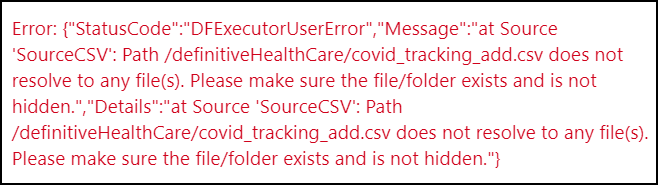
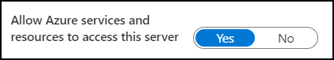
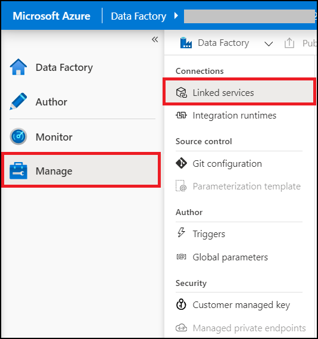
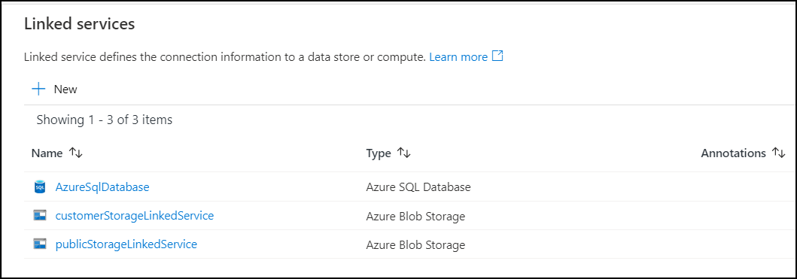
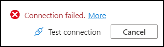
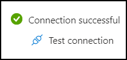

## Table Of Contents:

1. Troubleshooting Azure Data Factory Pipelines
  - Activity Failure: Copy Data 
  - Activity Failure: Mapping Data Flow
  - Linked Service: Incorrect credentials
  - Manually Trigger Pipeline
  - Activate Trigger for the Pipeline

## Troubleshooting Azure Data Factory Pipelines

### Activity Failure: Copy Data 

Error:

Reasons:-
1. The source file is not present is the Public environment's storage account

Resolution: For resolution contact the admin of the public environment and ask them to make sure that the file has been generated at the specified path.

2. Incorrect or Expired SAS URI

While deploying the customer environment we provide a SAS URI that includes a token which allows the data factory to authenticate with the Azure Storage account. The SAS token has an expiry date, it may be that teh token has expired. To fix this please reach out to the Public env team to share an updated token.

### Activity Failure: Mapping Data Flow 
Error:

![Mapping Data Flow error]b(./images/LoadDataIntoStagingTableSQL.png)

Reasons:
1. The SQL Database is not accepting connections from Azure services

Resolution: 
1. Open the SQL database in the Azure portal, navigate to **Show Firewall Settings** in the overview page. You can also find this option in the menu in the left hand pane named as **Firewalls and Virtual Networks**. 

2. In the firewall settings page, make sure that the option **Allow Azure services and resources to access this server** is set to **Yes**.

3. Make sure that connection strings are correct by viewing the Linked service connections' details mentioned below. The connection strings for the SQL database can be found by navigating to **SQl DB -> Overview**. Here, click on **Show database connection strings** link which is shown under 'Connection strings' heading.

### Linked Service: Incorrect credentials

1. Navigate to **ADF -> Manage -> linked Services**

2. This will show you the list of all the linked services being used in this data factory.

3. To verify if a linked service works, click on the linked service this will open a menu on the right side where all connection details can been and updated.

4. Make sure that all of the parameters are correct. Finally, to verify that if the provided credentials are correct click on **Test Connection**.

5. Connection failure: In case of failure please update the credentials and make sure that the respective service is up and running and then try again.

6. Connection Success:

### Manually Trigger Pipeline

After the deployment you can go inside your resource group, open the ADF **Author and monitor** section and trigger the pipeline as shown below.

### Activate Trigger for the Pipeline

If the trigger is deployed along with pipeline, you have to explicitly activate that trigger as shown below.

